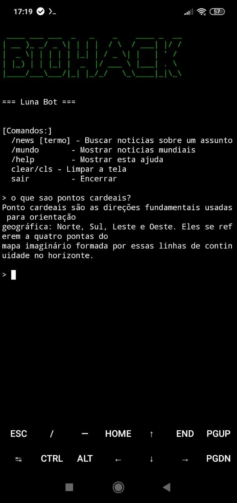
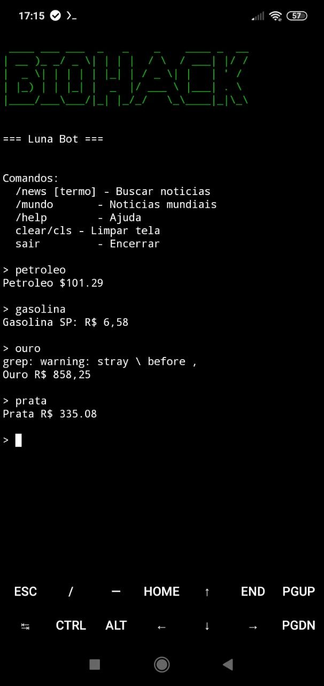

# 🌙 Luna ChatBot - Sua IA Offline no Android

[]
[]
[]
[]

**Luna** é uma assistente pessoal inteligente que roda 100% OFFLINE no seu Android via Termux. Utilizando o modelo local **Ollama (Qwen2.5 1.5B)** , Luna mantém seus dados privados e funciona sem depender de internet.

Especializada em sobrevivência, preparação para emergências, bushcraft e primeiros socorros, com respostas rápidas, diretas e práticas.

---

## ✨ Funcionalidades

| Módulo | Descrição |
|--------|-----------|
| 🧠 **LLM Offline** | Modelo Qwen2.5 1.5B local - privacidade total |
| 📰 **Notícias** | Busca por assunto via Google News RSS |
| 🌦️ **Clima** | Temperatura, vento, umidade, pressão |
| 💰 **Cotações** | Dólar, Ouro, Prata, Petróleo, Gasolina |
| 🖥️ **Sistema** | Espaço em disco, IP público, scan de rede |
| 🔌 **SSH** | Servidor SSH automático na porta 8022 |
| ⚡ **Leve** | Baixíssimo consumo de recursos Android |

---

## 💎 Por que escolher Luna?

✅ **100% Offline** - Funciona sem internet
✅ **Privacidade** - Nada sai do seu dispositivo
✅ **Grátis** - Sem mensalidades ou taxas
✅ **Rápido** - Respostas instantâneas
✅ **Leve** - Roda em qualquer Android 7+

---

## 📱 Requisitos Mínimos

| Item | Especificação |
|------|---------------|
| Sistema | Android 7.0 ou superior |
| App | Termux (F-Droid) |
| Espaço | ~2GB para o modelo |
| Internet | Apenas na instalação |

---

# 📸 Screenshot

Imagem do programa:




---

## 🚀 Instalação

### 1. Instale o Termux
Baixe pelo [F-Droid](https://f-droid.org/pt/packages/com.termux/) (recomendado)

### 2. Execute os comandos abaixo no Termux

```bash
# Clona o repositório para o seu dispositivo
git clone https://github.com/biohack-dev/Luna-IA-Offline

# Entra na pasta do projeto
cd Luna-IA-Offline

# Dá permissão de execução ao instalador
chmod +x install.sh

# Copia todos os arquivos para a raiz do Termux
cp -r * ~/

# Volta para a raiz do Termux
cd ~

# Executa o instalador (baixa dependências e configura o modelo)
./install.sh

# Inicia a Luna IA
python3 luna.py

---
